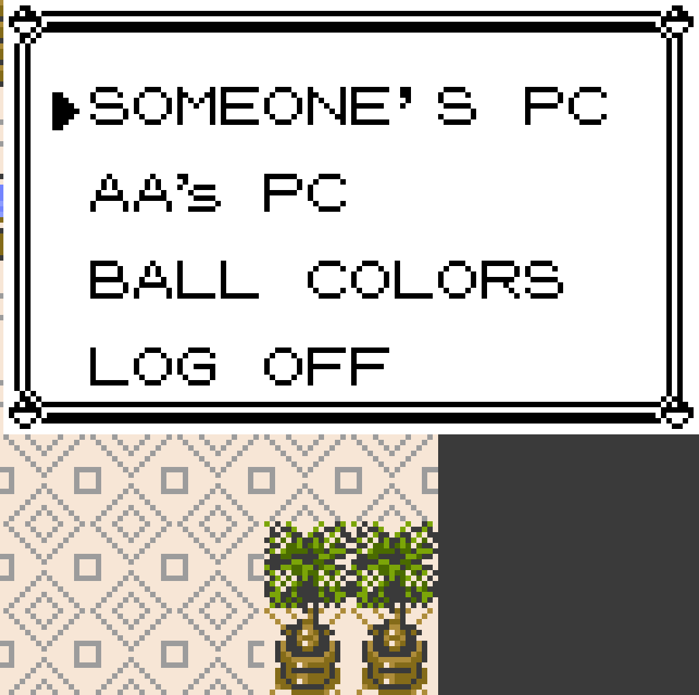
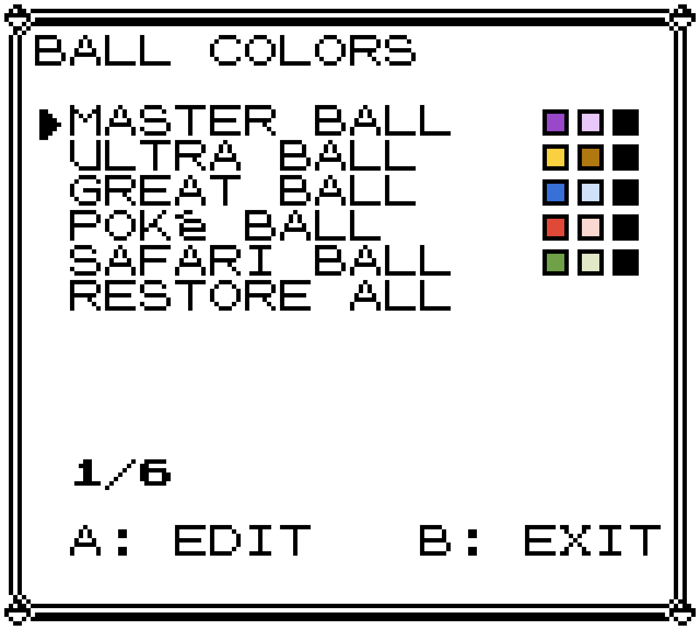
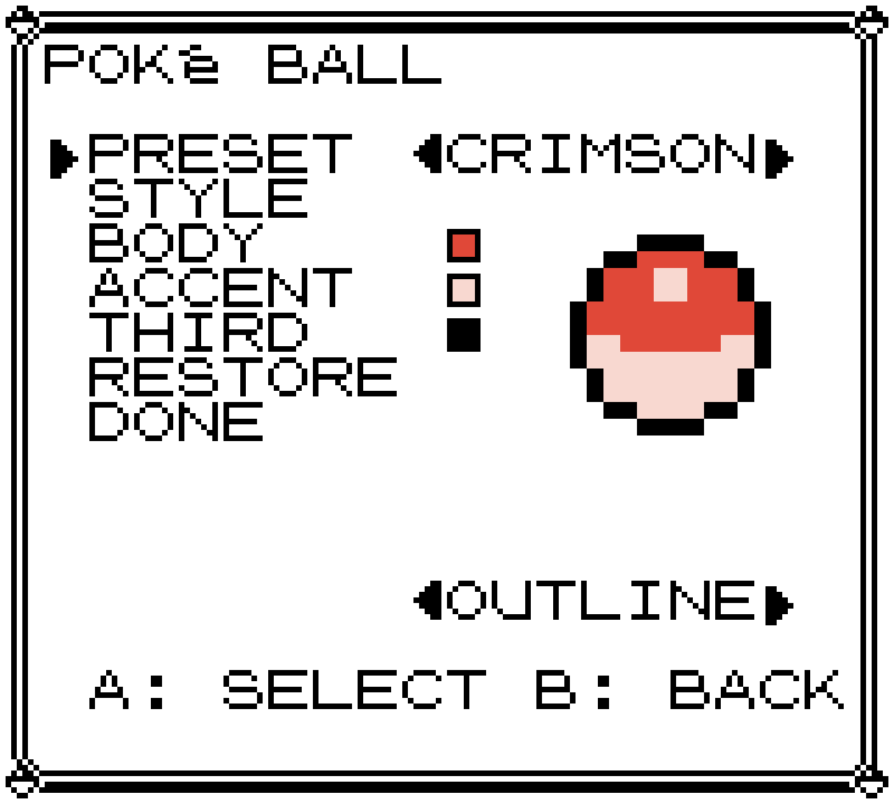
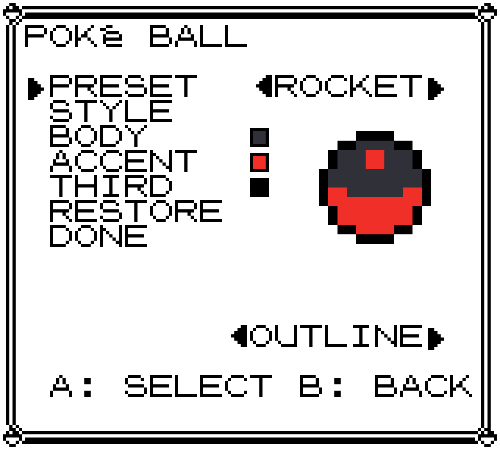
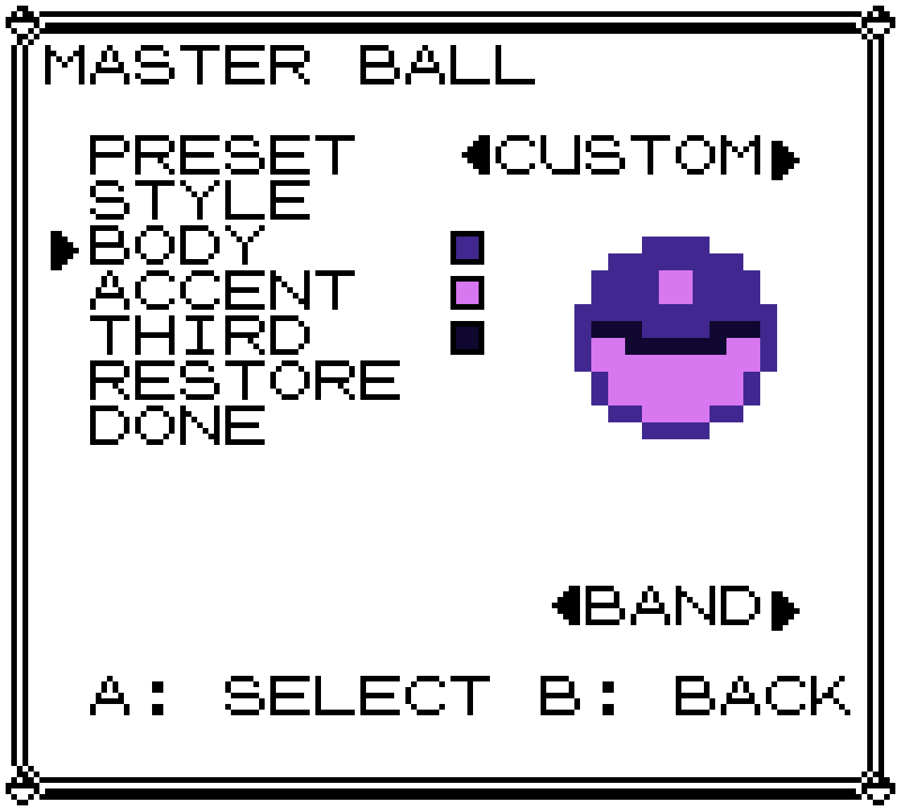
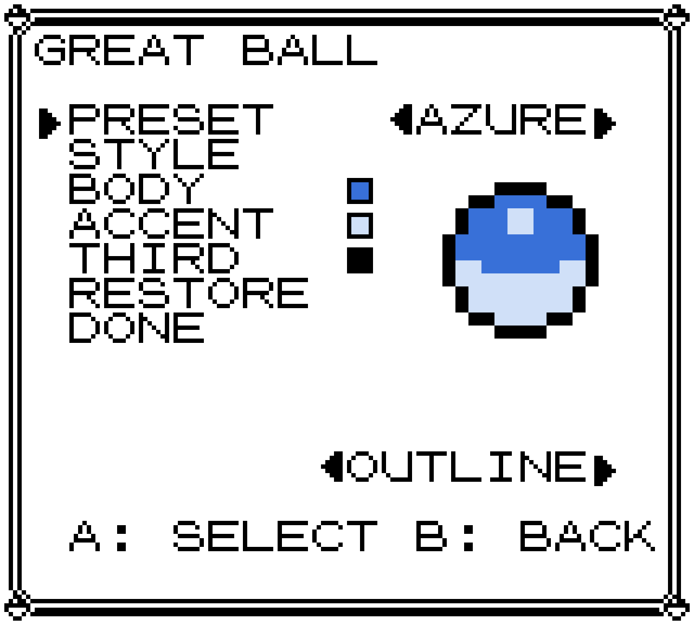
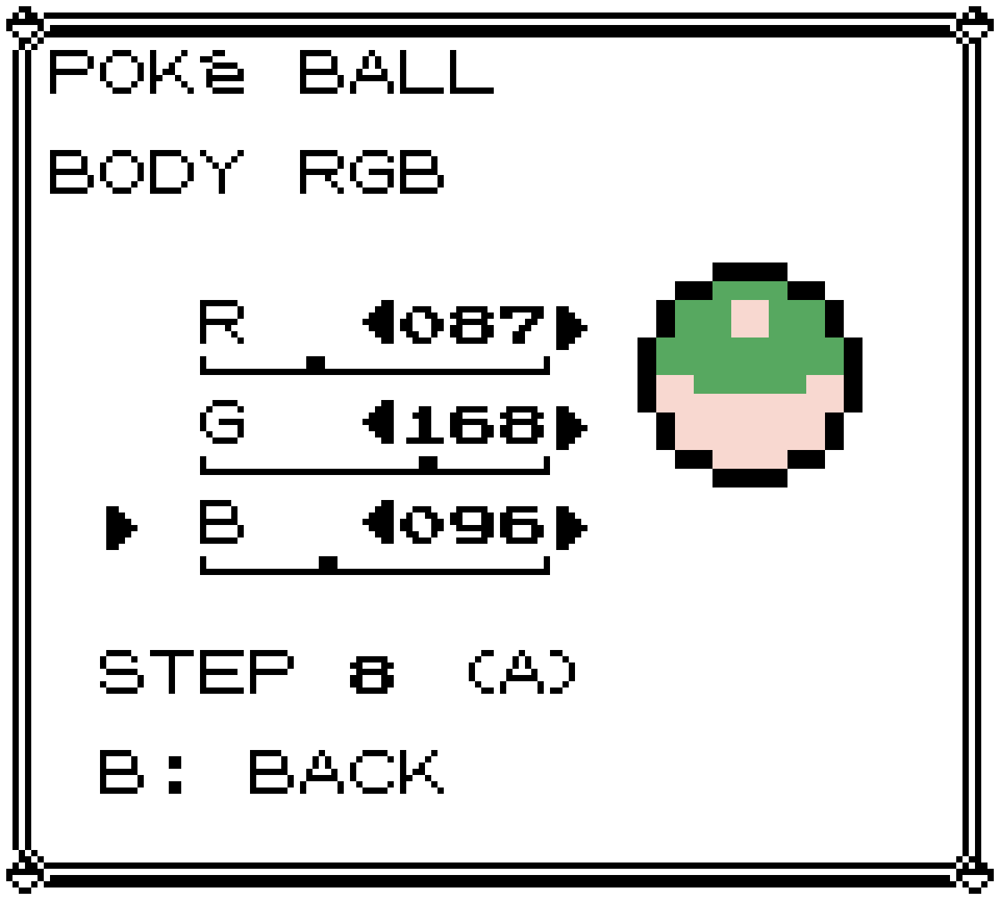
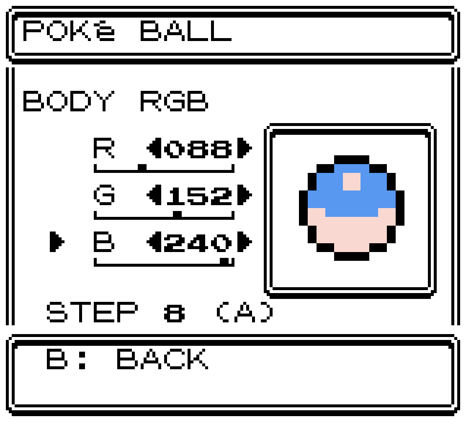
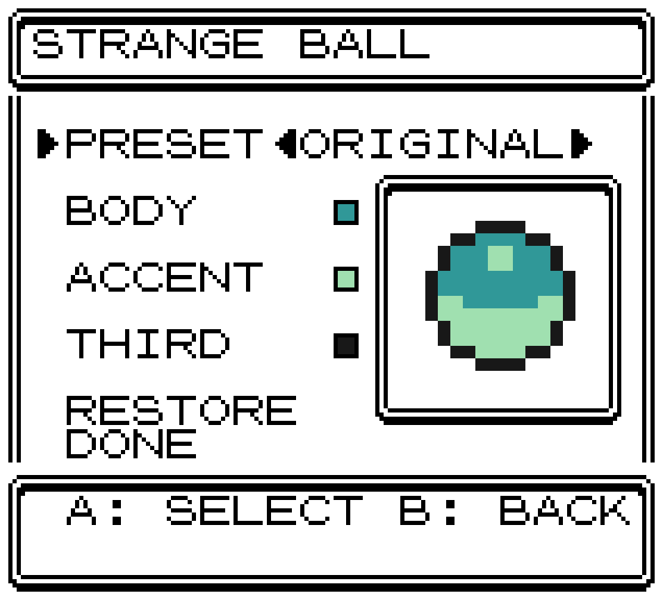
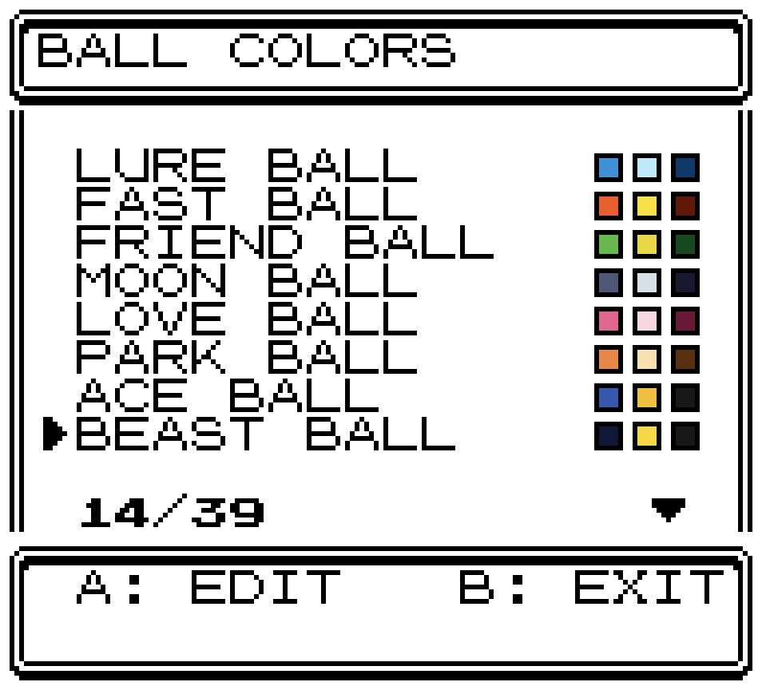

# Pokeball Colors

For both Gen 1 and Gen 2. Colors all balls and includes a ball colors editor to let you customize the colors however you like.

Covers all vanilla and mod balls.

## Design your own balls

Open the PC and choose **BALL COLORS** — or move it to the START menu from the
mod's options. Every ball in your game is listed, including balls other mods
have added.

| | |
| --- | --- |
|  |  |
| It lives on the PC by default. A mod that replaces the PC? Put it on the START menu instead. | Every ball at a glance, with its body, accent and third colour. **RESTORE ALL** at the bottom puts every ball back to its default. |
|  |  |
| Pick a preset built for that ball — the preview is the real sprite, in your colours. | Presets are tailored per ball, so a Poke Ball offers different looks from an Ultra Ball. |
|  |  |
| On Red, Blue and Yellow, **STYLE** puts the third colour on the seam band… | …or on the rim. Hand-edited colours read **CUSTOM**. |
|  |  |
| Or set body, accent and third colour by hand, 0-255 on each channel — the rail under each channel shows where it sits. | Gold, Silver and Crystal draw the same screens in the game's own framed panels, in whatever frame style you chose. |
|  |  |
| Balls other mods add show up on their own. **ORIGINAL** is that mod's colour; presets sit beside it. | Thirty-nine balls with Too Many Balls installed — the counter and ▼ keep your place. |

On **Red, Blue and Yellow**, change BODY and ACCENT, and add either a colored
band or an outline — one or the other, not both.

On **Gold, Silver and Crystal** there's no band-or-outline choice: the ball
keeps its own artwork and uses all three of your colors as it is.

**RESTORE** puts one ball back to its default. **RESTORE ALL**, at the bottom
of the ball list, does every ball at once.

At the Pokemon Center, the heal machine's balls light up in the colors of the
ball each party member was caught in and will update after colors are changed
in the editor.

Purely cosmetic. No catch rates, items, marts or battle logic are changed by
this mod.

## Requirements

- **Red, Blue and Yellow:** COLORS must be set to **ADVANCED**.
- **Gold, Silver and Crystal:** nothing to set.
- gen1recomp **0.1.38 or newer** (Gen 2 needs **0.1.78+**, and is simply
  inactive on older builds). No hard mod dependencies.

## Options

Open **MODS → POKEBALL COLORS → OPTIONS** (F10 mod manager):

| Option | Default | Effect |
| ------ | ------- | ------ |
| COLORED BALLS | ON | Master switch for all ball coloring |
| COLORED BALLS AT POKeMON CENTER | ON | The heal machine's balls use each mon's caught ball |
| MY BALL COLORS OVER OTHER MODS | OFF | Win the ball art when another mod supplies its own |
| RECOLOR BALLS IN GEN 2 GAMES | ON | Gold/Silver/Crystal's own balls use this mod's colors by default |
| BALL COLORS MENU IS IN | PC | Where the editor lives: PC, START MENU, or BOTH |
| DEV: EVERY BALL SOLD IN MARTS | OFF | Every mart stocks every ball in the game |

Every toggle is live — they take effect on your next throw, no restart needed.

**DEV: EVERY BALL SOLD IN MARTS** is a testing aid: buy any ball and see what
it looks like thrown. Turning it back off restores the normal shelves
completely — nothing is written to your save, and balls you already bought
stay in your bag.

### Running alongside a mod that replaces ball artwork

Some sprite packs bring their own ball art and draw it without this mod's
colours. This mod notices and **steps aside**, so you keep theirs and nothing
needs configuring. Turn on **MY BALL COLORS OVER OTHER MODS** if you'd rather
have these colours — the trade is that an overridden ball is painted directly,
so it can't follow the background palette or do the Master/Ultra strobe.

## Installation

**First install**

1. Download the mod zip from the [latest release](../../releases/latest).
2. Open the launcher's **MODS** browser and tap **Import mod .zip** (on iOS,
   delete any previously downloaded copy of the zip from Files first so you
   don't import a stale one).
3. On Red, Blue or Yellow, set COLORS to ADVANCED. Fully quit and relaunch.

**Updates**

After the first install, no re-download needed: the mod browser checks this
repo's releases automatically. When a new version is out, the mod's entry shows
*"vX.Y.Z available"* — tap it, then **Update**. Fully quit and relaunch
afterward so the new code is actually live.

## Compatibility

Works in Red, Blue, Yellow, Gold, Silver and Crystal. Nothing here touches map
or text data, and there are no hard dependencies.

- **Custom Poké Balls** by magalvao — its nine balls color automatically.
- **Too Many Balls** — its balls color automatically, and its Kecleon Ball
  takes the colour of whatever you throw it at. Customizing it overrides that;
  **RESTORE** makes it dynamic again.
- **Snag Quest** (0.11.x+) — owns its Snag Ball's colour and registers it here.
- **Dramatic Shape** — tested and working in voxel mode.
- Any other ball mod — its balls appear in the editor on their own.

## For mod authors

Colour your own balls in one call, contribute a named preset to a ball this
mod already owns, or register a resolver for a ball whose colour isn't fixed.
See **[docs/MODDING.md](docs/MODDING.md)**.

## Credits

By **Mister Miracle** ([@mistermiracle3036](https://github.com/mistermiracle3036)).
Built for [gen1recomp](https://github.com/bryanthaboi/gen1recomp).
Colors for the nine balls from
[Custom Poké Balls](https://github.com/magalvao/custom-pokeballs) by
magalvao were matched by eye to that mod's own sprite art; no assets are
used or redistributed. The mart-stocking approach behind the DEV option
follows the shelf mechanism magalvao's mod established and Snag Quest
refined — no code was copied from either.

The black band rearranges the colour indices of the ball sprite. That
artwork is ROM-derived, so this mod ships none of it: the rearranged sheet
is rebuilt in memory each session from the one your own game extracted
from your own cartridge.

Licensed **MIT** — see [LICENSE](LICENSE). That covers this mod's own
code, and makes no claim over ROM-derived material or Nintendo
trademarks.

Pokémon and all related names are trademarks of Nintendo / Creatures Inc.
/ GAME FREAK inc. This is an unofficial fan project, not affiliated with
or endorsed by any of them, and it requires your own copy of the game.

See [THIRD_PARTY_NOTICES.md](THIRD_PARTY_NOTICES.md).
